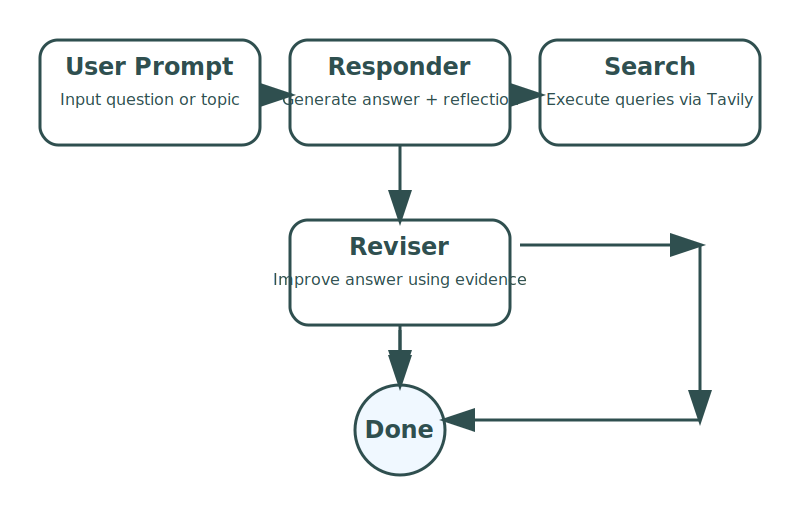

# research_agent_reflexion

A Bun-based research agent prototype that uses LangChain, OpenAI, and Tavily search to answer questions, self-reflect, and iteratively improve responses.

## Topic

This repository implements a `Research Agent with Reflexion` architecture. The topic is about building an AI workflow that:

- starts with a question from the user,
- generates an initial research answer,
- critiques its own output for missing or unnecessary information,
- formulates targeted search queries,
- retrieves external evidence,
- and revises the answer to improve accuracy and completeness.

### Why this topic matters

Research agents are useful when you need more than a single prediction. They help capture reasoning, handle uncertainty, and combine generative answers with external knowledge. This project demonstrates those concepts in a simple CLI experiment.

## Image



## Why this project exists

- Demonstrates a production-ready agent pipeline using structured output and stateful reasoning.
- Shows how to integrate a search tool into an LLM loop.
- Provides a simple CLI for interactive experimentation.

## Key features

- Stateful agent graph with `@langchain/langgraph`
- Structured JSON output validation using `zod`
- Reflection-driven search query generation
- Search refinement using Tavily search results
- Revision loop with termination logic

## Prerequisites

- Bun installed (`https://bun.sh`)
- `OPENAI_API_KEY` set in your environment
- Internet access for OpenAI and Tavily services

## Installation

```bash
bun install
```

## Running the agent

```bash
bun run index.ts
```

Or with npm:

```bash
npm run dev
```

## Usage

1. Run the agent.
2. Enter a prompt when asked.
3. Type `bye` to exit.
4. The agent prints the latest answer from the graph.

Example:

```bash
Enter prompt (type bye to exit): What is reflexion in research agents?
```

## Folder structure

```text
.
├─ assets/
│  └─ research-agent-workflow.svg  # diagram of agent flow
├─ model/
│  └─ llm.ts                      # OpenAI LLM configuration
├─ prompt/
│  └─ prompt.ts                   # prompt organization placeholder
├─ schema/
│  └─ Schema.ts                   # schema validation with zod
├─ state/
│  └─ State.ts                    # state annotations for LangGraph
├─ tools/
│  └─ tool.ts                     # search executor integration
├─ grpah.ts                       # agent graph definition and flow
├─ index.ts                       # CLI entrypoint
├─ package.json
└─ README.md
```

## Project structure details

- `index.ts` - CLI entrypoint. Reads user input and invokes the state graph.
- `grpah.ts` - Defines the agent graph and transitions between responder, search executor, and reviser.
- `model/llm.ts` - Configures the OpenAI chat model used throughout the workflow.
- `schema/Schema.ts` - Defines expected structured output for answers and reflections.
- `state/State.ts` - Declares state annotations for message history, current answer, search results, and loop count.
- `tools/tool.ts` - Executes generated search queries using Tavily and returns structured results.
- `prompt/prompt.ts` - Placeholder location for future prompt templates and reusable prompt logic.

## How it works

1. The `responder` node produces an initial answer, reflection, and search queries.
2. The `searchExecutor` node executes the generated queries against Tavily.
3. The `reviser` node rewrites the answer using the reflection and retrieved search results.
4. The graph repeats search+revision until the answer is complete or the loop count limit is reached.

## Notes for production

- Keep `OPENAI_API_KEY` secure and do not commit it to source control.
- Add logging and error handling as needed before deploying.
- Replace placeholder prompt definitions in `prompt/prompt.ts` for cleaner prompt management.
- Consider adding a `.env` loader or configuration file for environment variables.

## License

This project is currently private and intended for experimentation and prototype use.
